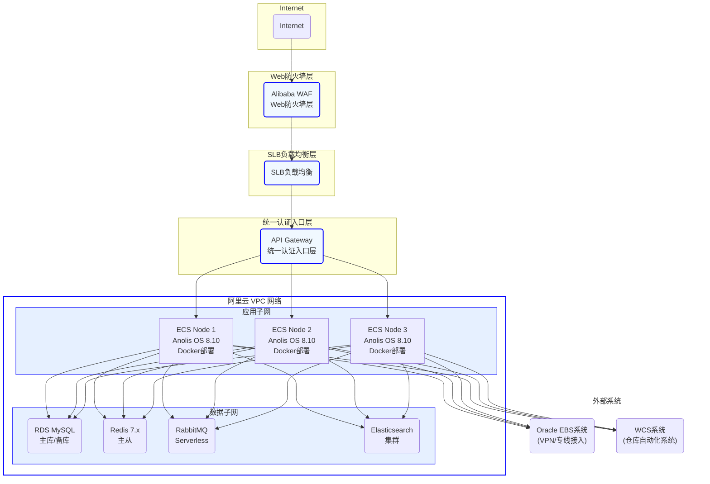

```mermaid
flowchart TD

    %% 定义样式
    subgraph cloud_internet [Internet]
        direction TB
        internet_cloud(Internet)
    end

    subgraph cloud_security [Web防火墙层]
        direction TB
        waf("Alibaba WAF <br> Web防火墙层")
    end
    style waf fill:#F0F8FF,stroke:#0000FF,stroke-width:2px

    subgraph cloud_load_balancing [SLB负载均衡层]
        direction TB
        slb(SLB负载均衡)
    end
    style slb fill:#F0F8FF,stroke:#0000FF,stroke-width:2px

    subgraph cloud_gateway [统一认证入口层]
        direction TB
        api_gateway("API Gateway <br> 统一认证入口层")
    end
    style api_gateway fill:#F0F8FF,stroke:#0000FF,stroke-width:2px

    subgraph vpc_network [阿里云 VPC 网络]
        direction TB
        subgraph subnet_app [应用子网]
            direction LR
            ecs1["ECS Node 1 <br> Anolis OS 8.10 <br> Docker部署"]
            ecs2["ECS Node 2 <br> Anolis OS 8.10 <br> Docker部署"]
            ecs3["ECS Node 3 <br> Anolis OS 8.10 <br> Docker部署"]
        end
        style subnet_app fill:#E6F0FF,stroke:#0000FF,stroke-width:1px

        subgraph subnet_data [数据子网]
            direction LR
            rds_mysql("RDS MySQL <br> 主库/备库")
            redis("Redis 7.x <br> 主从")
            rabbitmq("RabbitMQ <br> Serverless")
            elasticsearch("Elasticsearch <br> 集群")
        end
        style subnet_data fill:#E6F0FF,stroke:#0000FF,stroke-width:1px
    end
    style vpc_network fill:#FFFFFF,stroke:#0000FF,stroke-width:2px

    subgraph external_systems [外部系统]
        direction LR
        oracle("Oracle EBS系统 <br> (VPN/专线接入)")
        wcs("WCS系统 <br> (仓库自动化系统)")
    end
    style external_systems fill:#FFFFFF,stroke:#FFFFFF,stroke-width:1px

    %% 流程连接
    internet_cloud --> waf
    waf --> slb
    slb --> api_gateway
    api_gateway --> ecs1 & ecs2 & ecs3

    %% 应用子网与数据子网连接（假设应用需要访问数据）
    ecs1 --> rds_mysql
    ecs1 --> redis
    ecs1 --> rabbitmq
    ecs1 --> elasticsearch
    ecs2 --> rds_mysql
    ecs2 --> redis
    ecs2 --> rabbitmq
    ecs2 --> elasticsearch
    ecs3 --> rds_mysql
    ecs3 --> redis
    ecs3 --> rabbitmq
    ecs3 --> elasticsearch

    %% 应用子网与其他系统连接
    ecs1 --> oracle
    ecs1 --> wcs
    ecs2 --> oracle
    ecs2 --> wcs
    ecs3 --> oracle
    ecs3 --> wcs

    %% 图标定义 (使用font awesome)
    class internet_cloud fa:fa-cloud
    class waf fa:fa-shield-alt
    class slb fa:fa-network-wired
    class api_gateway fa:fa-cubes
    class ecs1 fa:fa-server
    class ecs2 fa:fa-server
    class ecs3 fa:fa-server
    class rds_mysql fa:fa-database
    class redis fa:fa-database
    class rabbitmq fa:fa-server
    class elasticsearch fa:fa-search
    class oracle fa:fa-laptop-code
    class wcs fa:fa-warehouse

```