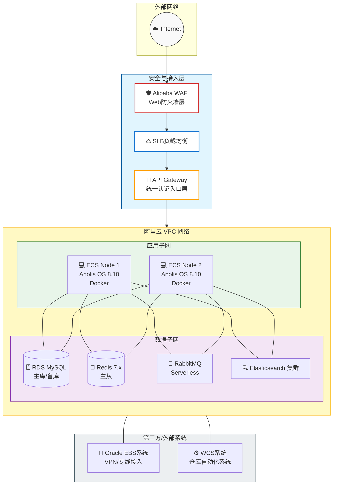

```mermaid
graph TD
    subgraph Public_Network [外部网络]
        Internet(("☁️ Internet"))
    end

    subgraph Security_Layer [安全与接入层]
        WAF["🛡️ Alibaba WAF<br/>Web防火墙层"]
        SLB[⚖️ SLB负载均衡]
        APIGW["🧩 API Gateway<br/>统一认证入口层"]
    end

    subgraph VPC [阿里云 VPC 网络]
        direction TB
        
        subgraph App_Subnet [应用子网]
            ECS1["💻 ECS Node 1<br/>Anolis OS 8.10<br/>Docker"]
            ECS2["💻 ECS Node 2<br/>Anolis OS 8.10<br/>Docker"]
        end

        subgraph Data_Subnet [数据子网]
            RDS[("🗄️ RDS MySQL<br/>主库/备库")]
            Redis[("🚀 Redis 7.x<br/>主从")]
            MQ["📨 RabbitMQ<br/>Serverless"]
            ES[🔍 Elasticsearch 集群]
        end
    end

    subgraph External_Systems ["第三方/外部系统"]
        EBS["🏢 Oracle EBS系统<br/>VPN/专线接入"]
        WCS["⚙️ WCS系统<br/>仓库自动化系统"]
    end

    Internet --> WAF
    WAF --> SLB
    SLB --> APIGW
    APIGW --> VPC
    
    ECS1 & ECS2 --- RDS
    ECS1 & ECS2 --- Redis
    ECS1 & ECS2 --- MQ
    ECS1 & ECS2 --- ES

    VPC --- EBS
    VPC --- WCS

    style Internet fill:#f9f9f9,stroke:#333
    style Security_Layer fill:#e1f5fe,stroke:#01579b
    style VPC fill:#fff9c4,stroke:#fbc02d
    style App_Subnet fill:#e8f5e9,stroke:#2e7d32
    style Data_Subnet fill:#f3e5f5,stroke:#7b1fa2
    style External_Systems fill:#eceff1,stroke:#455a64
    style WAF fill:#fff,stroke:#d32f2f,stroke-width:2px
    style SLB fill:#fff,stroke:#1976d2,stroke-width:2px
    style APIGW fill:#fff,stroke:#ffa000,stroke-width:2px

```